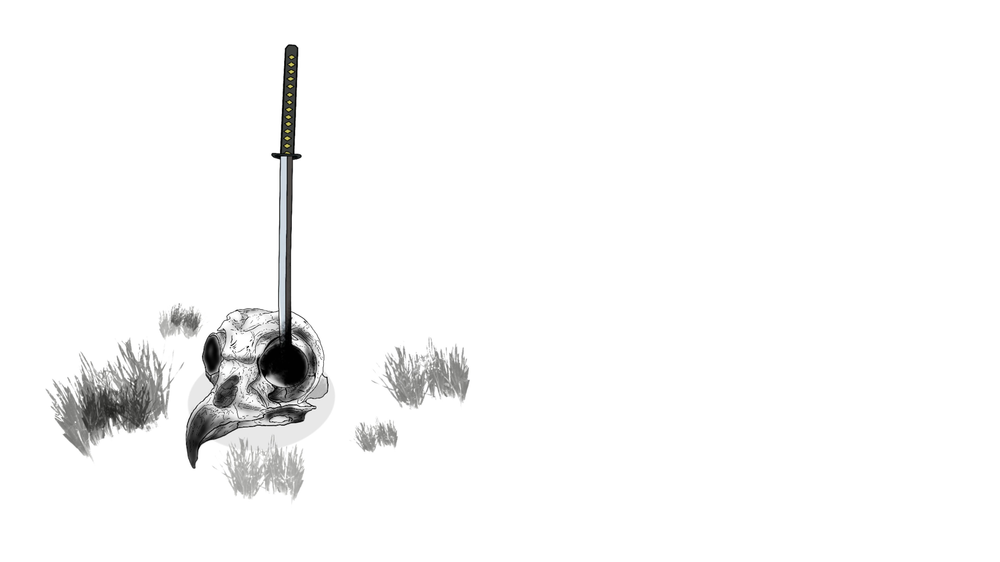

  
  

<h1 align="center" style="font-family: 'Futura', sans-serif; color: #E0E4E8;">Alec Filios</h1>
<h3 align="center" style="font-family: 'Futura', sans-serif; color: #A0A4A8;">AI Engineer | Game Development | Full-Stack Developer</h3>
  

    I am Alec Filios, an AI Engineer and Full-Stack Developer passionate about integrating AI into game development. 
  

 

    I specialize in creating intelligent NPCs with Unity ML-Agents and enhancing games with large language models (LLMs).
  

  
  
  
  
  
  
  
  

  

  

